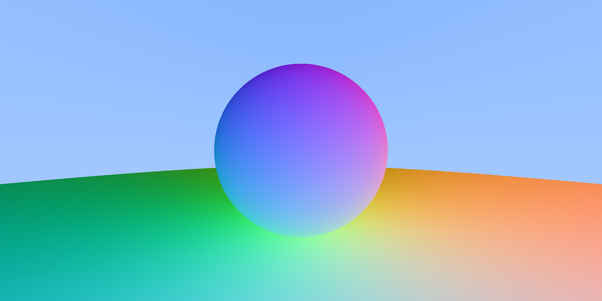

# raytracer-weekend
This is a small raytracing project that I whipped up over the course of a
weekend from a tutorial in C++ that HadalHW17 provided to me.

Obviously, _it's not in C++._

When I put this project down & never picked it back up again I was in the
process of:
 - Adding random noise through the use of a monad into some of the calculations
 - Refactoring things into a typeclass called Intersectable that I wanted
   all my datatypes to use.

Didn't ever get around to finishing it.

# Pretty output picture
### No, I can't angle a plane correctly thank you.

